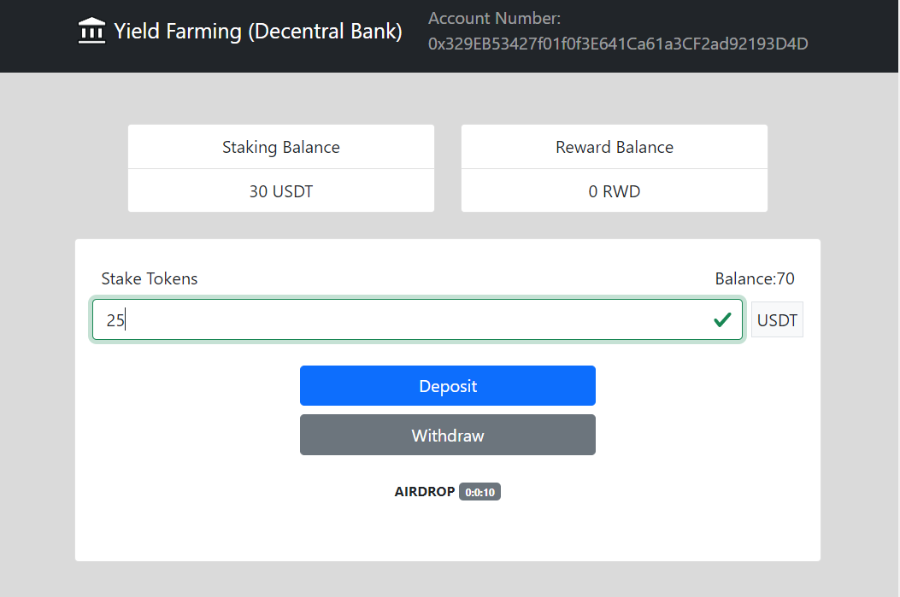

# Defi project yield farming

Inicializar Proyecto
## Requerimientos:
Instalar Truffle Globally
### `npm install -g truffle `
Instalar Dependencias
### `npm install`
Abrir Ganache e integrar con Metamask para tests
### `truffle migrate --reset`
Abrir proyecto localhost:3000
### `npm start`

Tests: Mocha y Chai
React, Bootstrap, Solidity, Web3

### Screenshots
